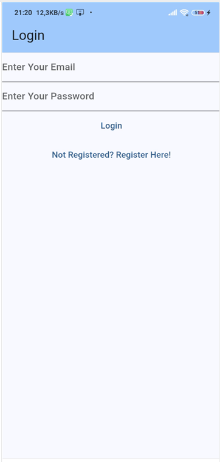
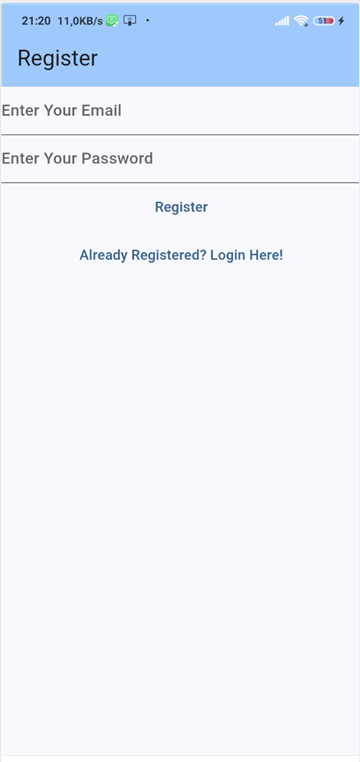
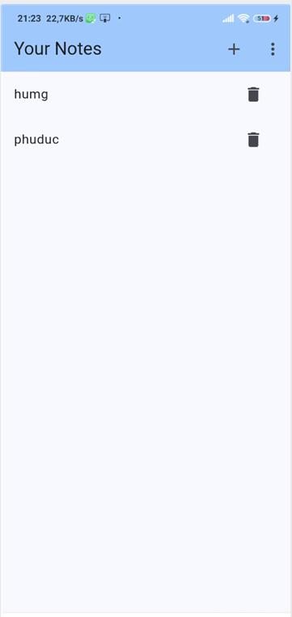
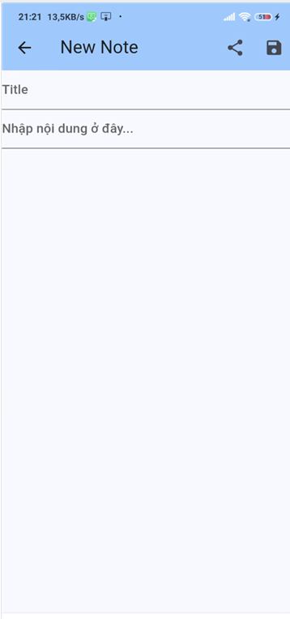
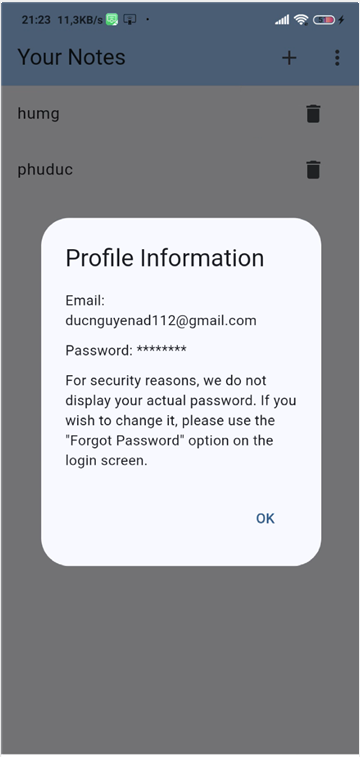
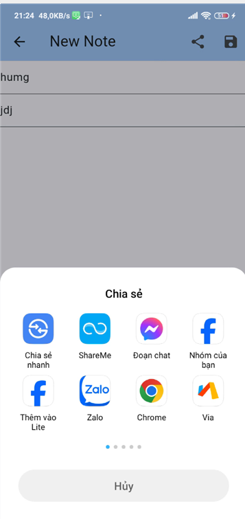

## Notes App 🐳

## 💡 Các chức năng

- [x] Đăng nhập và đăng kí bằng email và mật khẩu
- [x] Tạo Notes
- [x] Sửa Notes
- [x] Xóa Notes
- [x] Chia sẻ Notes
- [x] Xem thông tin người dùng

# 📸 Screenshots

| 1 | 2|
|------|-------|
|||

| 3 | 4|
|------|-------|
|||


| 5 | 6|
|------|-------|
|||

## Cách cài đặt

1. Clone this repo:
   ```bash
   git clone https://github.com/ngphuduc1608/btlflutter.git
   ```

2. Mở thư mục dự án này bằng **VS Code**:
   ```bash
   cd btlflutter
   ```

3.
   ```bash
   flutter upgrade
   ```

4.
   ```bash
   flutter pub get
   ```

5.
   ```bash
   flutter run
   ```

### Cấu trúc mã
>- |--lib
>    - |-- constants 
>      - |-- route.dart (set mặc định của các url)
>    - |-- enums 
>      - |-- menu_action.dart (set menu có những chức năng gì)
>    - |-- services 
>      - |-- auth
>        - |-- auth_exceptions.dart (tạo các ngoại lệ khi sử dụng Firebase Authentication.)
>        - |-- auth_provider.dart 
>        - |-- auth_service.dart
>        - |-- auth_user.dart
>        - |-- firebase_auth_provider.dart(xử lý các ngoại lệ sử dụng Firebase Authentication.)
>      - |-- cloud
>        - |-- cloud_note.dart( tạo các biến dữ liệu lưu trữ note khi sử dụng Firebase Firestore.)
>        - |-- cloud_storage_constants.dart( tạo các hằng lưu trữ)
>        - |-- cloud_storage_exceptions.dart( tạo các ngoại lệ khi sử dụng Firebase Firestore.)
>        - |-- firebase_cloud_storage.dart(xử lý các ngoại lệ )
>    - |-- ultilies
>      - |-- dialogs
>        - |-- cannot_share_empty_note_dialog.dart  (tạo hộp thông báo không thể chia sẻ)
>        - |-- delete_dialog.dart  (tạo hộp thông báo có xác nhận xóa không)
>        - |-- error_dialog.dart  (tạo hộp thông báo thông tin đăng nhập ko chính xác)
>        - |-- generic_dialog.dart  (tạo hộp thông báo notes)
>        - |-- logout_dialog.dart  (tạo hộp thông báo có xác nhận đăng xuất không)
>        - |-- profile_dialog.dart  (tạo hộp thông báo hiển thị profile)
>        - |-- resgister_dialog.dart  (tạo hộp thông báo hiển thị đăng kí thành công)
>      - |-- generrics
>        - |-- get_arguments.dart  
>    - |-- views
>      - |-- notes
>        - |-- create_update_note_view.dart  (giao diện trang tạo notes)
>        - |-- notes_list_view.dart ( giạo diện trang notes list)
>        - |-- notes_view.dart (giao diện ban đầu của notes)  
>      - |-- login_view.dart  (giao diện trang đăng nhập)
>      - |-- register_view.dart  (giao diện trang đăng kí)
>    - |-- main.dart


